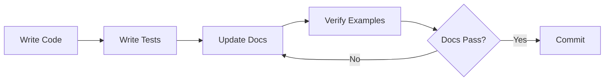

# Doc Guardian - Documentation Maintenance Skill

Keeps documentation synchronized with code, prevents gaps, and enforces quality standards. **Documentation that lies is worse than no documentation.**

## Prerequisites

**Required Tools:**
- `fd` - Fast file finder (install: `brew install fd`)
- `rg` (ripgrep) - Fast text search (install: `brew install ripgrep`)
- `pnpm` - Package manager for frontend projects
- Standard POSIX tools: `sed`, `awk`, `grep`

**Environment Assumptions:**
- All commands must be run from the **project root directory**
- Relative paths in documentation are resolved from the project root
- Templates in `assets/` directory must exist before use
- `lefthook.yml` must be configured for pre-commit hooks (see Pro Tips)

**Project Structure:**
- Documentation lives in `client/apps/docs/src/content/docs/`
- Templates are in `.ruler/skills/doc-guardian/assets/`
- Code packages are in `client/packages/` and `server/engine/`

## When to Use

- **Feature Implementation**: After adding/modifying features, update docs IMMEDIATELY
- **Code Review**: Check if code changes have corresponding doc updates
- **Refactoring**: Update examples, APIs, and references
- **Architecture Changes**: Update diagrams, decision records, and guides
- **Periodic Audits**: Run doc verification checks regularly
- **Pull Request Review**: Validate doc coverage before merge

## Critical Patterns

### 1. Documentation Structure (This Project)

```markdown
client/apps/docs/src/content/docs/
├── overview/               # Project introduction, architecture
├── developer-guide/        # Setup, workflows, patterns
├── backend/               # Spring Boot, Kotlin, DB docs
├── frontend/              # Vue, Astro, component docs
├── configuration/         # Env vars, config files
├── conventions/           # Code style, naming
├── testing/               # Unit, integration, E2E
└── deployment/            # CI/CD, Docker, infra
```

### 2. Verification Checklist (Run Before Committing)

| Check            | Command                                                    | Fix                          |
| ---------------- | ---------------------------------------------------------- | ---------------------------- |
| Dead links       | See script below                                           | Update broken internal links |
| TODO markers     | `rg 'TODO\|FIXME\|XXX' client/apps/docs/src/content/docs/` | Complete or remove markers   |
| Code examples    | `rg '```(typescript\|kotlin)' -A 10 client/apps/docs/`     | Verify syntax, update APIs   |
| Outdated dates   | `rg 'Last updated: 20[0-9]{2}' client/apps/docs/`          | Update to current year       |
| Missing sections | Compare `AGENTS.md` with `/docs/`                          | Add missing topics           |

### 3. Documentation Drift Detection

**Code-First Approach**: Documentation follows code, never the opposite.

```bash
# Find public APIs without docs
if ! rg 'export (class|function|const)' client/packages/ --no-filename > /tmp/exports_raw.txt 2>&1; then
  echo "Error: Failed to find exports" >&2
  exit 1
fi

# Transform using sed (POSIX-compatible)
if ! sed -e 's/export (class|function|const|interface|type) //' \
     -e 's/(.*//' \
     -e 's/{.*//' \
     -e '/^\/\//d' \
     -e '/^\/\*/d' < /tmp/exports_raw.txt > /tmp/exports.txt; then
  echo "Error: Failed to transform exports" >&2
  exit 1
fi

# Check if documented
while read -r api; do
  [ -z "$api" ] && continue
  rg -q "$api" client/apps/docs/ || echo "Missing: $api"
done < /tmp/exports.txt
```

### 4. Documentation Quality Gates

**NEVER commit without verifying:**

1. **Code Example Works**: Copy-paste and run it
2. **Types Match**: Check imports, interfaces
3. **Links Resolve**: Click every internal link
4. **Version Accurate**: Update version numbers
5. **Screenshots Current**: Re-capture if UI changed

### 5. Documentation Templates (See `assets/`)

| Template                   | Use When                           |
| -------------------------- | ---------------------------------- |
| `feature-doc.md`           | New feature added                  |
| `api-doc.md`               | New public API/endpoint            |
| `migration-guide.md`       | Breaking changes                   |
| `architecture-decision.md` | ADR (Architecture Decision Record) |

## Commands

**Note:** Run all commands from the project root directory.

```bash
# Verify all docs links are valid (non-http links only)
# This checks internal markdown links and resolves relative paths correctly
fd -e md -e mdx . client/apps/docs/ -x sh -c '
  SOURCE_FILE="$1"
  SOURCE_DIR=$(dirname "$SOURCE_FILE")
  rg "\[.*\]\(((?!http)[^)]+)\)" "$SOURCE_FILE" -o --no-filename | while IFS= read -r match; do
    # Extract link and strip fragment
    link=$(echo "$match" | sed "s/.*](//; s/).*//")
    linkfile=$(echo "$link" | sed "s/#.*//")

    # Skip http(s) links explicitly
    case "$linkfile" in
      http://*|https://*) continue ;;
    esac

    # Resolve relative path from source file directory
    if [ "${linkfile#/}" = "$linkfile" ]; then
      # Relative path - resolve from source directory
      linkfile="$SOURCE_DIR/$linkfile"
    fi

    # Normalize path
    linkfile=$(cd "$(dirname "$linkfile")" 2>/dev/null && echo "$PWD/$(basename "$linkfile")" || echo "$linkfile")

    # Test existence
    if [ ! -f "$linkfile" ]; then
      echo "Broken in $SOURCE_FILE: $link -> $linkfile"
    fi
  done
' sh {} \;

# Find undocumented exports
rg 'export (class|function|const|interface|type)' client/packages/ \
  --no-filename -o \
  | sort -u \
  > /tmp/exports.txt
rg -f /tmp/exports.txt client/apps/docs/ || echo "Found undocumented exports"

# Check for stale dates
rg 'updated.*20[0-9]{2}' client/apps/docs/ --no-filename

# Find TODO/FIXME in docs
rg 'TODO|FIXME|XXX' client/apps/docs/

# Lint markdown
pnpm --filter @cvix/docs markdownlint '**/*.md'

# Verify code examples compile (requires type definitions)
# Note: This extracts TypeScript blocks but may need imports/types added manually
# For production use, wrap each snippet in a proper module with imports
echo '// Auto-generated from docs - may require manual type definitions' > /tmp/code-samples.ts
echo 'import type { ReactNode } from "react";' >> /tmp/code-samples.ts
echo 'import type { Component } from "vue";' >> /tmp/code-samples.ts
echo '// Add other common imports as needed' >> /tmp/code-samples.ts
echo '' >> /tmp/code-samples.ts

# Extract code blocks, skip imports already present, wrap in scope
rg '```typescript' -A 20 client/apps/docs/ | \
  sed '/^```/d' | \
  awk 'BEGIN {block=0} /^import/ {next} {print}' >> /tmp/code-samples.ts

echo '// Run: pnpm tsc --noEmit --skipLibCheck /tmp/code-samples.ts' >> /tmp/code-samples.ts
echo '// Note: May need to install @types packages: pnpm add -D @types/node' >> /tmp/code-samples.ts
```

## Workflow: Feature → Documentation



1. **Write Feature Code** → `client/packages/utilities/src/chunk.ts`
2. **Write Tests** → `client/packages/utilities/src/chunk.spec.ts`
3. **Update API Docs** → `client/apps/docs/src/content/docs/developer-guide/utilities.md`
4. **Add Usage Example** → Use real, working code
5. **Run Verification** → Check links, syntax, examples
6. **Commit Together** → Code + tests + docs in same PR

## Anti-Patterns (NEVER DO THIS)

❌ **Update docs "later"** → It never happens
❌ **Copy-paste outdated examples** → Verify first
❌ **"TODO: Add docs"** → Write it NOW
❌ **Document implementation details** → Document PUBLIC API only
❌ **Screenshots without dates** → Add "Last updated: YYYY-MM-DD"
❌ **Assume AI-generated docs are correct** → VERIFY everything

## Integration with AGENTS.md

This project uses `AGENTS.md` as the source of truth for AI agents. When updating:

1. **AGENTS.md** → High-level commands, workflows, project structure
2. **client/apps/docs/** → Detailed guides, API references, tutorials
3. **Keep them synced** → AGENTS.md should reference docs, not duplicate

Example AGENTS.md entry:

```markdown
## Testing

See [Testing Guide](client/apps/docs/src/content/docs/testing/overview.md) for details.

**Quick commands:**
- `pnpm test` - Run all tests
- `pnpm test:e2e` - Run E2E tests
```

## Documentation Maintenance Schedule

| Frequency        | Task                                      |
| ---------------- | ----------------------------------------- |
| **Every commit** | Update docs for changed features          |
| **Weekly**       | Run dead link check                       |
| **Monthly**      | Review TODOs, update screenshots          |
| **Quarterly**    | Full audit, check all examples still work |
| **Per release**  | Update CHANGELOG, version numbers         |

## Resources

- **Templates**: See [assets/](assets/) for doc templates (verify these files exist before use)
- **AGENTS.md**: See [../../AGENTS.md](../../AGENTS.md) (project root reference guide)
- **Docs app**: See [client/apps/docs/](client/apps/docs/)
- **Starlight docs**: <https://starlight.astro.build/guides/authoring-content/> (check for latest docs)

## Pro Tips

1. **Verify Prerequisites**: See Prerequisites section above - ensure all tools are installed
2. **Use Symlinks**: Avoid duplicating docs (see `client/apps/docs/SYMLINK_SETUP.md`)
3. **Automate**: Add doc checks to `lefthook.yml` pre-commit (verify lefthook.yml exists and is configured)
4. **Template Files**: Verify all templates in `assets/` directory exist before referencing them
5. **Version Examples**: Use specific version in imports (`@cvix/utilities@1.2.3`)
6. **Test in Isolation**: Run doc code examples in fresh shell from project root
7. **Screenshot Tool**: Use `playwright screenshot` for consistent captures
