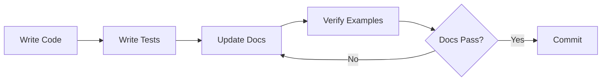

# Doc Guardian - Documentation Maintenance Skill

Keeps documentation synchronized with code, prevents gaps, and enforces quality standards. *
*Documentation that lies is worse than no documentation.**

## When to Use

- **Feature Implementation**: After adding/modifying features, update docs IMMEDIATELY
- **Code Review**: Check if code changes have corresponding doc updates
- **Refactoring**: Update examples, APIs, and references
- **Architecture Changes**: Update diagrams, decision records, and guides
- **Periodic Audits**: Run doc verification checks regularly
- **Pull Request Review**: Validate doc coverage before merge

## Critical Patterns

### 1. Documentation Structure (This Project)

```markdown
client/apps/docs/src/content/docs/
├── overview/               # Project introduction, architecture
├── developer-guide/        # Setup, workflows, patterns
├── backend/               # Spring Boot, Kotlin, DB docs
├── frontend/              # Vue, Astro, component docs
├── configuration/         # Env vars, config files
├── conventions/           # Code style, naming
├── testing/               # Unit, integration, E2E
└── deployment/            # CI/CD, Docker, infra
```

### 2. Verification Checklist (Run Before Committing)

| Check            | Command                                                                     | Fix                          |
|------------------|-----------------------------------------------------------------------------|------------------------------|
| Dead links       | `rg '\[.*\]\((?!http).*\)' client/apps/docs/src/content/docs/ \| rg '\.md'` | Update broken internal links |
| TODO markers     | `rg 'TODO\|FIXME\|XXX' client/apps/docs/src/content/docs/`                  | Complete or remove markers   |
| Code examples    | `rg '```(typescript\|kotlin)' -A 10 client/apps/docs/`                      | Verify syntax, update APIs   |
| Outdated dates   | `rg 'Last updated: 202[0-4]' client/apps/docs/`                             | Update to current year       |
| Missing sections | Compare `AGENTS.md` with `/docs/`                                           | Add missing topics           |

### 3. Documentation Drift Detection

**Code-First Approach**: Documentation follows code, never the opposite.

```bash
# Find public APIs without docs
rg 'export (class|function|const)' client/packages/ \
  --no-filename \
  | sd 'export (class|function|const) ' '' \
  | sd '\(.*' '' \
  > /tmp/exports.txt

# Check if documented
while read api; do
  rg -q "$api" client/apps/docs/ || echo "Missing: $api"
done < /tmp/exports.txt
```

### 4. Documentation Quality Gates

**NEVER commit without verifying:**

1. **Code Example Works**: Copy-paste and run it
2. **Types Match**: Check imports, interfaces
3. **Links Resolve**: Click every internal link
4. **Version Accurate**: Update version numbers
5. **Screenshots Current**: Re-capture if UI changed

### 5. Documentation Templates (See `assets/`)

| Template                   | Use When                           |
|----------------------------|------------------------------------|
| `feature-doc.md`           | New feature added                  |
| `api-doc.md`               | New public API/endpoint            |
| `migration-guide.md`       | Breaking changes                   |
| `architecture-decision.md` | ADR (Architecture Decision Record) |

## Commands

```bash
# Verify all docs links are valid
fd -e md -e mdx . client/apps/docs/ -x rg '\[.*\]\(((?!http).+)\)' {} \; \
  | rg -o '\((.+)\)' -r '$1' \
  | while read link; do [ -f "$link" ] || echo "Broken: $link"; done

# Find undocumented exports
rg 'export (class|function|const|interface|type)' client/packages/ \
  --no-filename -o \
  | sort -u \
  > /tmp/exports.txt
rg -f /tmp/exports.txt client/apps/docs/ || echo "Found undocumented exports"

# Check for stale dates
rg 'updated.*202[0-4]' client/apps/docs/ --no-filename

# Find TODO/FIXME in docs
rg 'TODO|FIXME|XXX' client/apps/docs/

# Lint markdown
pnpm --filter @cvix/docs markdownlint '**/*.md'

# Verify code examples compile
rg -A 10 '```typescript' client/apps/docs/ \
  | rg -v '```' \
  | tee /tmp/code-samples.ts
# Then check with: pnpm tsc --noEmit /tmp/code-samples.ts
```

## Workflow: Feature → Documentation



1. **Write Feature Code** → `client/packages/utilities/src/chunk.ts`
2. **Write Tests** → `client/packages/utilities/src/chunk.spec.ts`
3. **Update API Docs** → `client/apps/docs/src/content/docs/developer-guide/utilities.md`
4. **Add Usage Example** → Use real, working code
5. **Run Verification** → Check links, syntax, examples
6. **Commit Together** → Code + tests + docs in same PR

## Anti-Patterns (NEVER DO THIS)

❌ **Update docs "later"** → It never happens
❌ **Copy-paste outdated examples** → Verify first
❌ **"TODO: Add docs"** → Write it NOW
❌ **Document implementation details** → Document PUBLIC API only
❌ **Screenshots without dates** → Add "Last updated: YYYY-MM-DD"
❌ **Assume AI-generated docs are correct** → VERIFY everything

## Integration with AGENTS.md

This project uses `AGENTS.md` as the source of truth for AI agents. When updating:

1. **AGENTS.md** → High-level commands, workflows, project structure
2. **client/apps/docs/** → Detailed guides, API references, tutorials
3. **Keep them synced** → AGENTS.md should reference docs, not duplicate

Example AGENTS.md entry:

```markdown
## Testing

See [Testing Guide](client/apps/docs/src/content/docs/testing/overview.md) for details.

**Quick commands:**
- `pnpm test` - Run all tests
- `pnpm test:e2e` - Run E2E tests
```

## Documentation Maintenance Schedule

| Frequency        | Task                                      |
|------------------|-------------------------------------------|
| **Every commit** | Update docs for changed features          |
| **Weekly**       | Run dead link check                       |
| **Monthly**      | Review TODOs, update screenshots          |
| **Quarterly**    | Full audit, check all examples still work |
| **Per release**  | Update CHANGELOG, version numbers         |

## Resources

- **Templates**: See [assets/](assets/) for doc templates
- **AGENTS.md**: See [../../cvix/AGENTS.md](../../cvix/AGENTS.md)
- **Docs app**: See [client/apps/docs/](client/apps/docs/)
- **Starlight docs**: <https://starlight.astro.build/guides/authoring-content/>

## Pro Tips

1. **Use Symlinks**: Avoid duplicating docs (see `client/apps/docs/SYMLINK_SETUP.md`)
2. **Automate**: Add doc checks to `lefthook.yml` pre-commit
3. **Version Examples**: Use specific version in imports (`@cvix/utilities@1.2.3`)
4. **Test in Isolation**: Run doc code examples in fresh shell
5. **Screenshot Tool**: Use `playwright screenshot` for consistent captures
