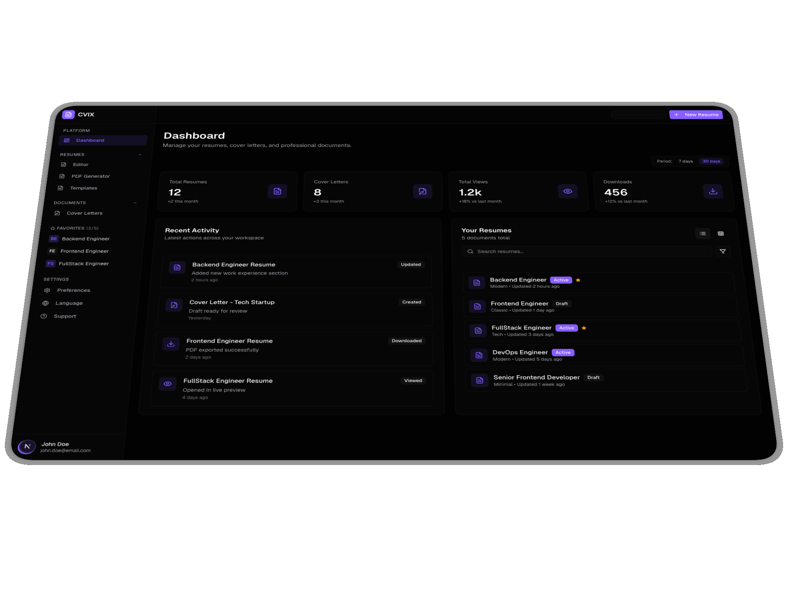

# 🧑‍💻 ProFileTailors



> **Modern Resume Generator Platform**
> Build, manage, and export professional résumés from a robust, accessible, cloud-ready system.

---

[](https://opensource.org/licenses/MIT)
[](https://pnpm.io/)
[](https://gradle.org/)
[](https://kotlinlang.org/)
[](https://spring.io/projects/spring-boot)
[](https://vuejs.org/)
[](https://tailwindcss.com/)
[](https://www.postgresql.org/)
[](https://www.keycloak.org/)
[](https://www.liquibase.org/)
[](https://www.docker.com/)

---
[](https://sonarcloud.io/summary/new_code?id=dallay_cvix)
[](https://sonarcloud.io/summary/new_code?id=dallay_cvix)
[](https://sonarcloud.io/summary/new_code?id=dallay_cvix)
[](https://sonarcloud.io/summary/new_code?id=dallay_cvix)
[](https://sonarcloud.io/summary/new_code?id=dallay_cvix)
[](https://sonarcloud.io/summary/new_code?id=dallay_cvix)
[](https://sonarcloud.io/summary/new_code?id=dallay_cvix)
[](https://sonarcloud.io/summary/new_code?id=dallay_cvix)
[](https://sonarcloud.io/summary/new_code?id=dallay_cvix)


[](https://sonarcloud.io/summary/new_code?id=dallay_cvix)

---

## ✨ What is ProFileTailors?

ProFileTailors is a **production-grade platform** for creating, customizing, and exporting professional résumés. No “SaaS starter” fluff—this is a working, modern webapp focused on real résumé management with best-in-class architecture, accessibility, and clean code standards.

---

## 🚀 Key Features

- 📝 **Full-featured résumé generator:**
  - Interactive web forms, dynamic previews, template selection, and fast PDF export (LaTeX engine)
  - Stellar UX: keyboard navigation, screen reader support (WCAG 2.1 AA)
  - Multi-language (English 🇺🇸 / Spanish 🇪🇸) support

- 🖥️ **Modern SPA frontend:**
  - Built with Vue 3, TypeScript, and Tailwind CSS
  - Sharply designed UI component library
  - Atomic, semantic styling driven by a token-based design system

- ⚡ **Reactive, modular backend:**
  - Kotlin + Spring Boot 3 (WebFlux, non-blocking I/O)
  - PostgreSQL, R2DBC, ensemble of unit/integration tests
  - Hexagonal (clean) architecture: domain, application, infrastructure separated like real professionals do

- 🔒 **Security-first by default:**
  - OAuth2 SSO via Keycloak
  - Row-level security (RLS), strict secrets management
  - Privacy by default; no sensitive data exposure

- 🛠️ **DevOps & automation baked-in:**
  - Quickstart local dev with Docker Compose
  - Unified linting, testing, CI/CD pipelines—runs *everything* by default

---

## 🖼️ Example Screens


---

## 📦 Project Structure

```text
├── client/   # Frontend: Vue SPA, Astro marketing, UI lib
├── server/   # Backend: Spring Boot, Kotlin, PostgreSQL
├── shared/   # Kotlin shared libs
├── infra/    # Infra as code: Docker Compose, secrets, monitoring
├── docs/     # Astro-powered docs site
├── .agents/  # AI agent configs, skills & workflow guides
```

---

## 🧰 Tech Stack

### 🏗️ Backend

- 👩‍💻 Kotlin 2, Spring Boot 3 (WebFlux, reactive)
- 🐘 PostgreSQL (UUIDs, RLS), R2DBC, Liquibase
- 🛡️ Keycloak 26, OAuth2 Resource Server
- 🧪 JUnit5, Kotest, MockK, Testcontainers

### 💻 Frontend

- ⚡ Vue 3, TypeScript, Pinia, Vee-Validate + Zod, TailwindCSS 4
- 🚀 Astro 5 (landing/docs), Markdown/MDX powered
- 🪄 UI: shadcn-vue, Reka UI, Lucide icons

### 🔄 Tooling & CI

- 🛠️ GitHub Actions, Lefthook, Biome, Detekt, Kover, Playwright & Vitest
- 🔄 Renovate for automated dependency management
- 🐳 Docker Compose stack (1-command everything)

---

## ⚡ Quickstart

**Prerequisites:**
- ☕ JDK 21+
- 🟩 Node.js 20+
- 📦 pnpm 10+
- 🐳 Docker + Docker Compose

**Run locally:**

```bash
make prepare-env   # Setup .env and config files
make install       # Install Node & Gradle dependencies
make ssl-cert      # Generate dev SSL certs
make backend-run   # Boot backend stack (Spring Boot/Postgres/Keycloak)
make dev-web       # Start Vue frontend (hot reload)
make verify-all    # ✅ Run all checks, tests, and linters
```

> 🔎 For advanced setup and deployment, see [.agents/](.agents/) and [docs/](docs/).

---

## ✅ Testing and Quality

- 🧹 All code is linted, statically checked, and must pass both **unit** and **integration** tests.
- 🧪 `make verify-all` is the definitive command, running all checks, tests, and linters across both frontend and backend.
- 📈 Code coverage thresholds enforced (backend: Kover, frontend: Vitest).
- 🤖 Every PR: full CI, security scan, and coverage checks.

---

## 🤝 Contribution

Open to focused, quality-driven contributions:
1. 🔍 Review your changes and follow [project conventions](.agents/)
2. ✅ Pass all tests and lints (`make test-all`)
3. 📝 Use clear, conventional commits (see [AGENTS.md](.agents/AGENTS.md))
4. 👀 See [CONTRIBUTING.md](CONTRIBUTING.md) and [CODEOWNERS](.github/CODEOWNERS)

---

## 📜 License

ProFileTailors is licensed under the MIT License. See [LICENSE](LICENSE).

---

## 📚 Reference & Documentation

- 📖 [Canonical architecture & style rules](.agents/)
- 📝 [Docs site](docs/)
- 🛡️ [Security policy](SECURITY.md)
- 🐳 [Docker deployment guide](infra/README.md)

---

## ❓ Questions?

Open an issue, or start with the [AGENTS.md](.agents/AGENTS.md) guide for a tour of project conventions.


---
[](https://deepwiki.com/dallay/cvix)
