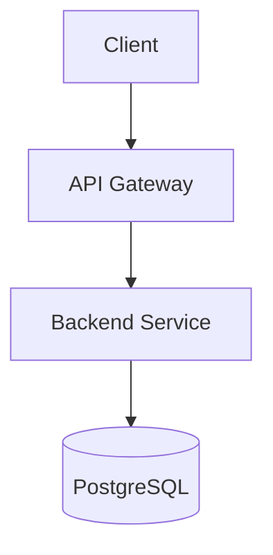

# ProFileTailors Documentation

> **Technical documentation site** built with Astro and Starlight for comprehensive project reference.

---

## Overview

The documentation site provides complete technical reference for ProFileTailors, including architecture, conventions, API documentation, and development guides. Built with **Astro** and the **Starlight** theme for optimal documentation UX.

### Features

- 📖 **Markdown/MDX**: Write documentation in familiar formats
- 🔍 **Built-in Search**: Fast, client-side search powered by Pagefind
- 🎨 **Themed**: Light and dark modes with customizable branding
- 🗂️ **Organized**: Automatic sidebar generation from file structure
- ⚡ **Fast**: Static generation for instant page loads
- ♿ **Accessible**: WCAG 2.1 AA compliant out of the box

---

## Project Structure

```text
src/
├── content/
│   └── docs/              # Documentation pages
│       ├── index.mdx      # Home page (splash template)
│       ├── guides/        # User and developer guides
│       ├── reference/     # API and technical reference
│       └── conventions/   # Code standards and best practices
├── assets/                # Images, logos, diagrams
└── styles/                # Custom styles (if needed)
```

---

## Development

### Prerequisites

- Node.js 24.12+
- pnpm 10+

### Commands

```bash
# From repository root
make dev-docs

# Or from docs project directory
cd client/apps/docs
pnpm dev

# Build for production
pnpm build

# Preview production build
pnpm preview
```

The dev server typically runs at `http://localhost:4321`.

---

## Adding Documentation

### Create a New Page

1. Add a Markdown/MDX file in `src/content/docs/`:

```text
src/content/docs/
├── quick-start.md          → /quick-start
├── guides/
│   └── deployment.md       → /guides/deployment
└── reference/
    └── api.md              → /reference/api
```

2. Add frontmatter to the file:

```markdown
---
title: "Quick Start Guide"
description: "Get ProFileTailors running locally in 5 minutes"
---

# Quick Start Guide

Your content here...
```

### Frontmatter Fields

| Field         | Required | Description                            |
|---------------|----------|----------------------------------------|
| `title`       | ✅ Yes    | Page title (shown in browser and sidebar) |
| `description` | ⚠️ Recommended | SEO description and page summary |
| `template`    | ❌ No     | Use `splash` for the home page         |
| `hero`        | ❌ No     | Hero section config (splash template only) |
| `sidebar`     | ❌ No     | Custom sidebar configuration           |

### Example: Basic Page

```markdown
---
title: "Deployment Guide"
description: "How to deploy ProFileTailors to production"
---

# Deployment Guide

## Prerequisites

- Docker 27+
- PostgreSQL 16+

## Steps

1. Build the application
2. Configure environment variables
3. Deploy to your platform
```

### Example: Home Page with Hero

```mdx
---
title: "ProFileTailors Docs"
description: "Complete technical documentation"
template: splash
hero:
  title: "ProFileTailors Documentation"
  tagline: "Build professional resumes with modern technology"
  image:
    alt: "ProFileTailors logo"
    file: ../../assets/logo.svg
  actions:
    - text: "Quick Start"
      link: /quick-start
      icon: right-arrow
      variant: primary
    - text: "View on GitHub"
      link: https://github.com/dallay/cvix
      icon: external
---

import { Card, CardGrid } from '@astrojs/starlight/components';

<CardGrid>
  <Card title="Architecture" icon="puzzle">
    Learn about the hexagonal architecture and domain-driven design.
  </Card>
  <Card title="API Reference" icon="seti:api">
    Complete REST API documentation.
  </Card>
</CardGrid>
```

---

## Using Starlight Components

Starlight provides built-in components for rich documentation:

### Cards

```mdx
import { Card, CardGrid } from '@astrojs/starlight/components';

<CardGrid>
  <Card title="Quick Start" icon="rocket">
    Get up and running in minutes.
  </Card>
  <Card title="Deployment" icon="cloud">
    Production deployment guides.
  </Card>
</CardGrid>
```

### Asides (Callouts)

```mdx
:::note
This is a note.
:::

:::tip
This is a helpful tip.
:::

:::caution
Be careful with this.
:::

:::danger
This is dangerous!
:::
```

### Code Blocks

````markdown
```typescript title="store.ts" {2-4}
import { defineStore } from 'pinia';

export const useStore = defineStore('main', {
  state: () => ({ count: 0 }),
});
```
````

---

## Organizing Content

### File Structure

Organize documentation by concern:

```text
src/content/docs/
├── index.mdx                  # Home page
├── quick-start.md             # Getting started
├── guides/                    # How-to guides
│   ├── development.md
│   ├── deployment.md
│   └── testing.md
├── reference/                 # Technical reference
│   ├── architecture.md
│   ├── api.md
│   └── database.md
└── conventions/               # Standards
    ├── git.md
    ├── kotlin.md
    └── vue.md
```

### Sidebar Configuration

Starlight generates the sidebar automatically from your file structure. For custom ordering, edit `astro.config.mjs`:

```javascript
export default defineConfig({
  integrations: [
    starlight({
      sidebar: [
        { label: 'Quick Start', link: '/quick-start' },
        {
          label: 'Guides',
          items: [
            { label: 'Development', link: '/guides/development' },
            { label: 'Deployment', link: '/guides/deployment' },
          ],
        },
        {
          label: 'Reference',
          autogenerate: { directory: 'reference' },
        },
      ],
    }),
  ],
});
```

---

## Assets

### Images

Store images in `src/assets/` and reference them:

```markdown

```

For optimized images, use Astro's `<Image>` component:

```mdx
import { Image } from 'astro:assets';
import architecture from '../../assets/architecture.png';

<Image src={architecture} alt="System architecture" />
```

### Diagrams

For technical diagrams, use:

- **Mermaid** (built-in): Flowcharts, sequence diagrams, etc.
- **SVG files**: Created with tools like draw.io or Figma

Example Mermaid diagram:

````markdown

````

---

## Linting and Validation

### Schema Validation

All content files are validated against the collection schema. Missing required fields (like `title`) will cause build errors:

```text
[ERROR] InvalidContentEntryDataError
File: src/content/docs/example.md
Missing required field: title
```

### Markdown Linting

The repository enforces markdown standards:

- Consistent heading hierarchy
- Proper list formatting
- Blank lines around headings

Run linting:

```bash
pnpm check
```

---

## Common Tasks

### Add a New Guide

1. Create file: `src/content/docs/guides/new-guide.md`
2. Add frontmatter:

```markdown
---
title: "New Guide"
description: "How to do something"
---
```

3. Write content
4. Test locally: `pnpm dev`
5. Commit changes

### Update Existing Documentation

1. Edit the file in `src/content/docs/`
2. Preview changes: `pnpm dev`
3. Commit with descriptive message:

```bash
git commit -m "docs: update deployment guide with Docker Compose instructions"
```

### Add Code Examples

Use fenced code blocks with syntax highlighting:

````markdown
```typescript
// Example TypeScript code
const greeting: string = "Hello, world!";
console.log(greeting);
```
````

For highlighted lines:

````markdown
```typescript {2,4-6}
const items = [1, 2, 3, 4];
const doubled = items.map(x => x * 2);  // Highlighted

// These lines are also highlighted
const sum = doubled.reduce((a, b) => a + b, 0);
console.log(sum);
```
````

---

## Deployment

### Build

```bash
pnpm build
```

Output: `dist/` directory with static files.

### Deploy Targets

- **Vercel**: Zero-config deployment
- **Netlify**: Automatic builds from Git
- **GitHub Pages**: Static hosting
- **Any static host**: Upload `dist/` contents

---

## Troubleshooting

### Build Errors

#### Missing Title Frontmatter

```text
Error: InvalidContentEntryDataError
Missing required field: title
```

**Solution**: Add `title` to frontmatter:

```markdown
---
title: "Page Title"
---
```

#### Broken Links

Use relative links and verify paths:

```markdown
<!-- ✅ Good -->
[Quick Start](../quick-start)

<!-- ❌ Bad -->
[Quick Start](/quick-start.md)
```

#### Missing Assets

Ensure assets exist at referenced paths:

```markdown

```

Check that `src/assets/logo.svg` exists.

---

## Contributing

When updating documentation:

1. Follow the repository's contribution guidelines (see root `CONTRIBUTING.md`)
2. Keep documentation in sync with code changes
3. Use clear, concise language
4. Add code examples where helpful
5. Test locally before committing
6. Use conventional commit messages:

```bash
git commit -m "docs: add API authentication guide"
```

---

## References

- [Starlight Documentation](https://starlight.astro.build/)
- [Astro Documentation](https://docs.astro.build/)
- [Markdown Guide](https://www.markdownguide.org/)
- [MDX Documentation](https://mdxjs.com/)
