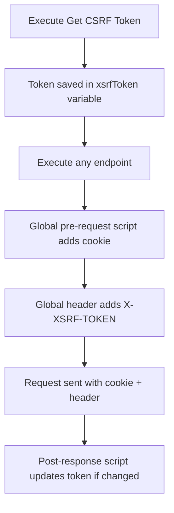
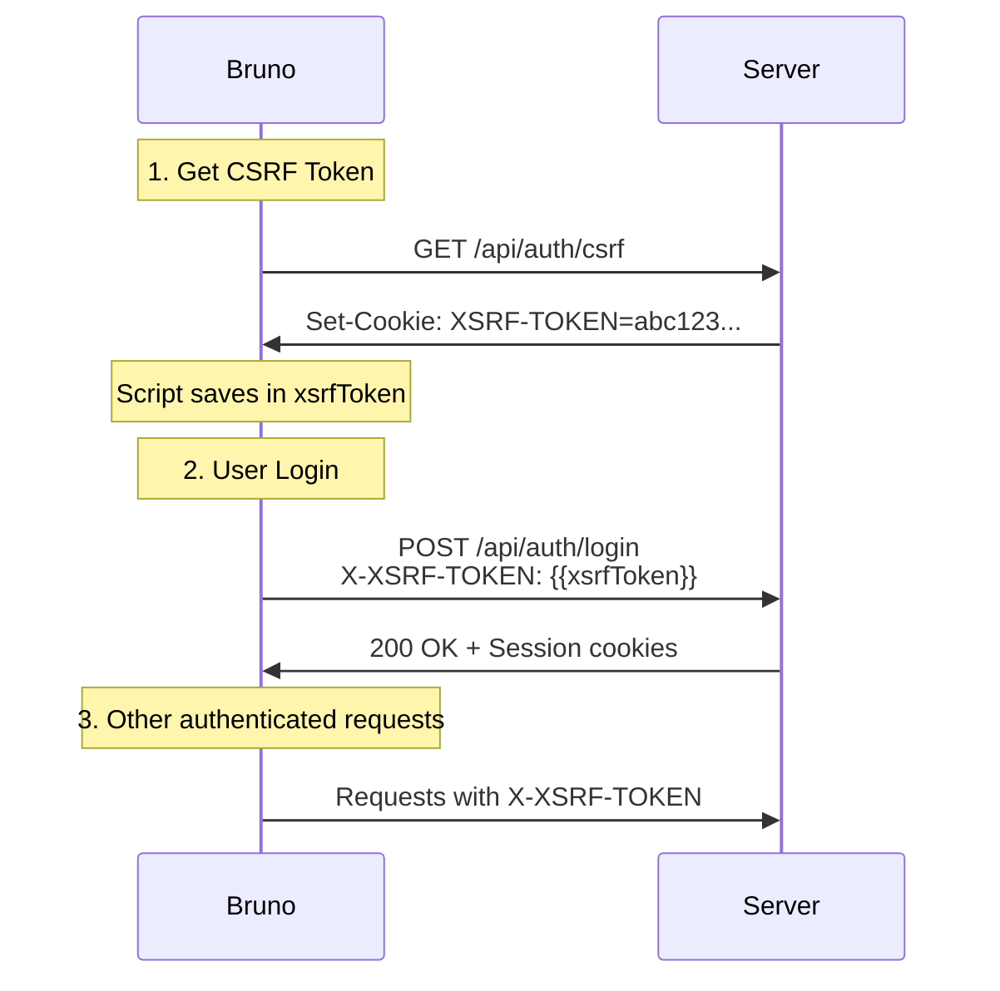

# 🚀 Bruno API Collection - CVIX

## 🌐 Global CSRF Configuration

### ✨ Automatic Global Scripts

This collection has **global scripts configured in `collection.bru`** that automatically:

1. ✅ Add the `X-XSRF-TOKEN` header to all requests
2. ✅ Ensure the `XSRF-TOKEN` cookie is sent automatically
3. ✅ Update the token if the server sends a new one

**You don't need to add individual scripts to each endpoint.** Everything is handled globally.

## 📁 Location

File: `collection.bru`

## ✨ Benefits of Global Configuration

### ✅ Before (Individual Configuration)

Each endpoint needed its own script:

```javascript
// In User Login.bru
script:pre-request
{
    const jar = bru.cookies.jar();
    const xsrfToken = bru.getEnvVar('xsrfToken');
    jar.setCookie(url, 'XSRF-TOKEN', xsrfToken);
}

// In Create Workspace.bru
script:pre-request
{
    const jar = bru.cookies.jar();
    const xsrfToken = bru.getEnvVar('xsrfToken');
    jar.setCookie(url, 'XSRF-TOKEN', xsrfToken);
}

// And so on for EVERY endpoint... 😫
```

### ✅ Now (Global Configuration)

A single script in `collection.bru` that applies to **ALL endpoints**:

```javascript
script:pre-request
{
    const xsrfToken = bru.getEnvVar('xsrfToken');
    const url = bru.getEnvVar('url');

    if (xsrfToken && url) {
        const jar = bru.cookies.jar();
        jar.setCookie(url, 'XSRF-TOKEN', xsrfToken);
    }
}
```

## 🔧 Complete Configuration in collection.bru

```bru
meta {
  name: cvix
}

headers {
  X-XSRF-TOKEN: {{xsrfToken}}
}

script:pre-request {
  // 🔧 Global CSRF Script - Runs before each request
  const xsrfToken = bru.getEnvVar('xsrfToken');
  const url = bru.getEnvVar('url');

  if (xsrfToken && url) {
    const jar = bru.cookies.jar();
    jar.setCookie(url, 'XSRF-TOKEN', xsrfToken);
  }
}

script:post-response {
  // 🔧 Global CSRF Script - Updates token if it changes
  const url = bru.getEnvVar('url');
  const jar = bru.cookies.jar();

  jar.getCookie(url, 'XSRF-TOKEN').then(cookie => {
    if (cookie && cookie.value) {
      const currentToken = bru.getEnvVar('xsrfToken');

      if (currentToken !== cookie.value) {
        bru.setEnvVar('xsrfToken', cookie.value);
        console.log('🔄 CSRF Token automatically updated');
      }
    }
  }).catch(() => {
    // Silence errors to avoid polluting logs
  });
}
```

## 🎯 What Each Part Does

### 1. Global Header

```bru
headers {
  X-XSRF-TOKEN: {{xsrfToken}}
}
```

**Effect**: ALL endpoints inherit this header automatically.

### 2. Global Pre-Request Script

```javascript
script:pre-request
{
    const xsrfToken = bru.getEnvVar('xsrfToken');
    const url = bru.getEnvVar('url');

    if (xsrfToken && url) {
        const jar = bru.cookies.jar();
        jar.setCookie(url, 'XSRF-TOKEN', xsrfToken);
    }
}
```

**Effect**: Before each request, ensures the XSRF-TOKEN cookie is in the Cookie Jar so it gets sent
with the request.

### 3. Global Post-Response Script

```javascript
script:post-response
{
    jar.getCookie(url, 'XSRF-TOKEN').then(cookie => {
        if (cookie && cookie.value) {
            const currentToken = bru.getEnvVar('xsrfToken');

            if (currentToken !== cookie.value) {
                bru.setEnvVar('xsrfToken', cookie.value);
                console.log('🔄 CSRF Token updated');
            }
        }
    });
}
```

**Effect**: After each response, checks if the server sent a new token and updates it automatically.

## � Endpoints that Inherit the Configuration

All these endpoints **DO NOT need individual scripts**:

### Authentication

- ✅ User Login
- ✅ User Logout
- ✅ Register User
- ✅ Get Session
- ✅ Account

### Workspaces

- ✅ Create workspace
- ✅ Update workspace
- ✅ Delete workspace
- ✅ Get All Workspaces
- ✅ Find a workspace

### Any Future Endpoint

Any new endpoint you add to the collection **will automatically inherit** the CSRF configuration.

## 🚫 Exceptions: Endpoints without CSRF

If you have endpoints that **DO NOT need** CSRF (for example, public endpoints), you can:

### Option 1: Override the header in the specific endpoint

```bru
headers {
  X-XSRF-TOKEN:   # ← Leave empty to override the global
}
```

### Option 2: Use auth: none

```bru
auth {
  mode: none
}
```

Endpoints with `auth: none` typically don't need CSRF.

## 🔄 Complete Flow



## 💡 Benefits

1. **DRY (Don't Repeat Yourself)**: No duplicate code in each endpoint
2. **Maintainability**: Changes in one place affect the entire collection
3. **Consistency**: All endpoints behave the same way
4. **Fewer errors**: Don't forget to add scripts to new endpoints
5. **Automatic updates**: Token renews itself if the server changes it

## �️ Endpoint Customization

If a specific endpoint needs additional logic, you can add local scripts that **run after** the
global ones:

```bru
# In User Login.bru
script:post-response {
  // The global script ALREADY executed
  // Here you can add login-specific logic

  if (res.status === 200) {
    console.log('✅ Login successful');
    // Specific logic...
  }
}
```

## 🚀 Quick Usage

### Step 1: Get Token (Only the First Time)

**Endpoint**: `authentication/Get CSRF Token`

```http
GET /api/auth/csrf
```

Execute this endpoint **only once** when starting your Bruno session.

### Step 2: Use Any Endpoint

Now **all your endpoints will work automatically** without needing additional scripts:

- ✅ `User Login`
- ✅ `User Logout`
- ✅ `Register User`
- ✅ `Create workspace`
- ✅ `Update workspace`
- ✅ `Delete workspace`
- ✅ Any other POST/PUT/DELETE endpoint

## 🔧 Environment Variables Configuration

The `environments/⚪ L O C A L.bru` file:

```bru
vars {
  xsrfToken:                          # ← Filled automatically
  url: http://localhost:8080
  keycloak-url: http://localhost:9080
  realm: loomify
  scope: openid
}
```

## 📝 Authentication Flow (Execution Order)

### Step 1: Get CSRF Token

**Endpoint**: `authentication/Get CSRF Token`

```http
GET /api/auth/csrf
```

**What it does:**

- Calls the specific endpoint to get the CSRF token
- Server sends the `XSRF-TOKEN` cookie
- The `post-response` script uses Bruno's Cookie API to read it
- Saves it in the `xsrfToken` environment variable

**Included script:**

```javascript
script:post-response
{
    // ✅ CORRECT WAY: Use Bruno Cookie API
    const jar = bru.cookies.jar();
    const url = bru.getEnvVar('url');

    setTimeout(async () => {
        const cookie = await jar.getCookie(url, 'XSRF-TOKEN');

        if (cookie && cookie.value) {
            const xsrfToken = cookie.value;
            bru.setEnvVar('xsrfToken', xsrfToken);
            console.log('✅ CSRF Token saved:', xsrfToken);

            // Ensure cookie is sent in future requests
            jar.setCookie(url, 'XSRF-TOKEN', xsrfToken);
        }
    }, 100);
}
```

### Step 2: Login

**Endpoint**: `authentication/User Login`

```http
POST /api/auth/login
X-XSRF-TOKEN: {{xsrfToken}}

{
  "email": "john.doe@loomify.com",
  "password": "S3cr3tP@ssw0rd*123",
  "rememberMe": false
}
```

**What it does:**

- Uses the token saved in `{{xsrfToken}}`
- The `pre-request` script verifies the token exists
- The `post-response` script shows information about the result

```json
{
    "email": "john.doe@loomify.com",
    "password": "S3cr3tP@ssw0rd*123",
    "rememberMe": false
}
```

**What it does:**

- Uses the token saved in `{{xsrfToken}}`
- The `pre-request` script verifies the token exists
- The `post-response` script shows information about the result

## 🔍 Debugging

### View current token

Execute this code in Bruno's console (script of any request):

```javascript
console.log('Current token:', bru.getEnvVar('xsrfToken'));
```

### Verify headers

The `User Login` script automatically shows:

- ✅ If the token is present before the request
- 📋 Cookies received after login
- ❌ Errors if something fails

### Common Problems

#### 1. "Invalid CSRF Token"

**Solution**: Execute "Get CSRF Token" first to get a valid token.

#### 2. Empty or undefined token

**Solution**:

- Verify the server is running on `http://localhost:8080`
- Execute "Get CSRF Token" again
- Check Bruno's console for extraction logs

#### 3. Cookie not sent

Bruno **does NOT send cookies automatically**. That's why we use the `X-XSRF-TOKEN` header with the
variable.

## 🆚 Difference with Postman

| Aspect         | Postman                | Bruno                       |
|----------------|------------------------|-----------------------------|
| **Cookies**    | Automatic management   | Manual via variables        |
| **CSRF Token** | Auto cookie + header   | Manual header with variable |
| **Scripts**    | Pre-request/Tests      | pre-request/post-response   |
| **Variables**  | `pm.environment.set()` | `bru.setEnvVar()`           |

## 🔄 Complete Workflow



## 📌 Important Endpoints

### Authentication - Related

- 🔑 **Get CSRF Token** - Get token (execute first)
- 🔐 **User Login** - Log in
- 🚪 **User Logout** - Log out
- 📝 **Register User** - Register new user
- 👤 **Account** - Account information
- 🎫 **Get Session** - Current session information

### Utilities

- 💓 **health-check** - Verify server is active
- 📊 **actuator/** - Monitoring endpoints

## 💡 Tips

1. **Always execute "Get CSRF Token" first** before any POST/PUT/DELETE operation
2. CSRF tokens expire, if you get errors, get a new token
3. Use Bruno's console to see script logs
4. The token is saved in the active environment, not globally

## 🛠️ Advanced Troubleshooting

### View all environment variables

```javascript
// In any Bruno script
console.log('All variables:', {
    xsrfToken: bru.getEnvVar('xsrfToken'),
    url: bru.getEnvVar('url'),
    keycloakUrl: bru.getEnvVar('keycloak-url')
});
```

### Force new token retrieval

1. Delete the variable: Environments → ⚪ L O C A L → Edit `xsrfToken` → Clear value
2. Execute "Get CSRF Token" again

### Verify cookie on server

```bash
curl -v http://localhost:8080/api/auth/csrf
```

You should see in the response:

```bash
Set-Cookie: XSRF-TOKEN=....; Path=/; SameSite=Lax
```

## 📚 References

- [Spring Security CSRF](https://docs.spring.io/spring-security/reference/servlet/exploits/csrf.html)
- [Bruno Documentation](https://docs.usebruno.com/)
- Backend CSRF implementation:
  `server/engine/src/main/kotlin/com/loomify/engine/authentication/infrastructure/filter/CookieCsrfFilter.kt`

## 📚 Bruno Documentation

- [Collection Scripts](https://docs.usebruno.com/scripting/collection-scripts)
- [Cookie Management](https://docs.usebruno.com/scripting/javascript-api/cookie-management)
- [Environment Variables](https://docs.usebruno.com/scripting/javascript-api/environment-variables)

## 🎉 Final Result

Now you only need:

1. Execute `Get CSRF Token` **once** at the start
2. All other endpoints work automatically
3. No more thinking about CSRF tokens 🚀
