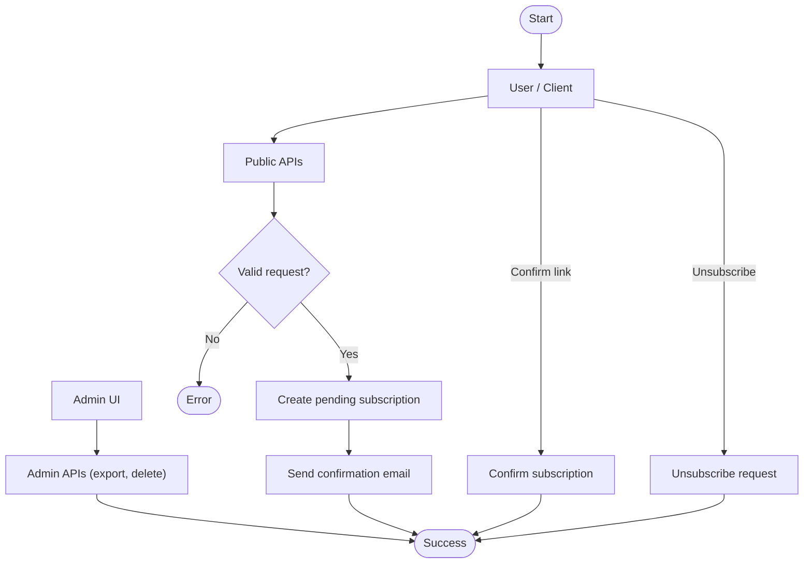
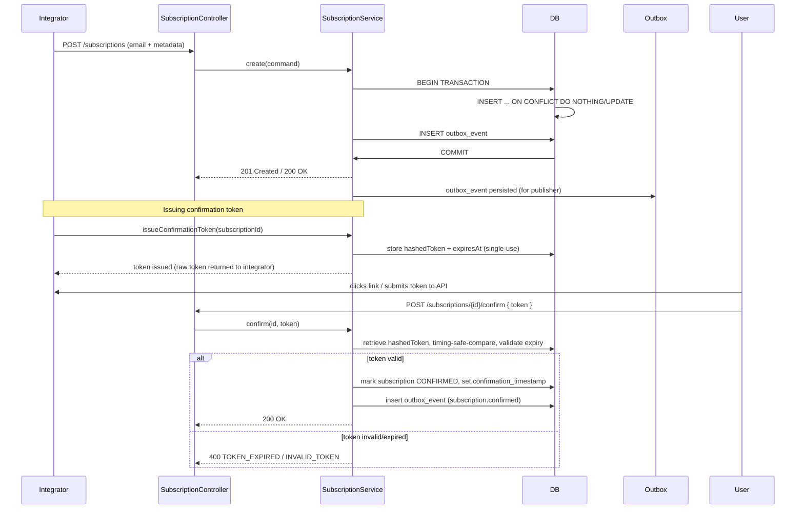

# Diagrams: Subscription Service

Here you go — a ready-to-paste mermaid diagram you can drop anywhere. No fuss: this covers the main capture, outbox, and confirmation flows. Paste it into docs/PRs/MD and you're done.

## Flowchart (high level)

## Sequence (confirmation and token issuance — critical detail)

## Quick notes (don't skip these)

- Idempotency: enforce UNIQUE(email_normalized, source) + INSERT ... ON CONFLICT. Do not use exists-before-insert due to race conditions.
- Atomicity: Subscription + Outbox must persist in the same transaction. Period.
- Tokens: generate with a CSPRNG, store only the hash with a salt, compare using a timing-safe compare, single-use token with a default TTL of 48h (configurable).
- OutboxPublisher: scheduler with exponential backoff + jitter, metrics and a DLQ.
- Metadata: validate size/depth before persisting (reject with 400). Defaults: total 10KB, max keys 100 (configurable).
- Security: rate-limiter (Redis sliding-window), IP hashing (HMAC-SHA256 with a pepper in KMS), RBAC on admin endpoints.
- Error schema: follow FR-008 — { code: UPPER_SNAKE_CASE, message, details? }.

---

If you'd like me to commit this or convert it to SVG/PNG and place it in the repo, tell me. Otherwise, it's ready.
